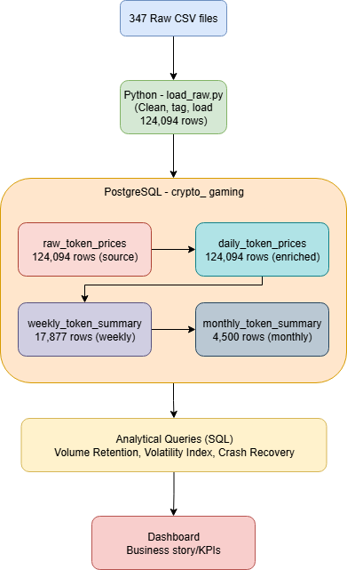

# Metaverse Token Economy Analysis
### An end-to-end data pipeline project

---

## Business Problem

Suppose that a crypto-based gaming studio is evaluating whether to build an in-game token economy.
Before committing engineering resources, they need to be able to answer three questions:

1. **Engagement** - Do metaverse tokens retain their trading volume over time, or do they spike and then subsequently die?
2. **Risk** - Which tokens are actually stable enough to hold up an in-game economy?
3. **Resilience** - When a token crashes, do players ever come back?

---

## Dataset

- **Source:** [Metaverse Coins Historical Data (Kaggle)](https://www.kaggle.com/datasets/kaushiksuresh147/metaverse-cryptos-historical-data)
- **Scope:** 347 metaverse and crypto gaming tokens
- **Period:** 2017 – 2022
- **Raw records:** 124,094 daily OHLCV rows
- **Fields:** Date, Open, High, Low, Close, Volume, Currency

---

## Pipeline Architecture

## Pipeline

### 1. Ingestion (`load_raw.py`)
- Reads all 347 CSVs from a local directory
- Derives `token_name` from filename
- Cleans data: standardizes dates, removes duplicates, fills null volumes
- Loads into PostgreSQL `raw_token_prices` table

### 2. Warehouse Tables (SQL)
| Table | Rows | Description |
|---|---|---|
| `raw_token_prices` | 124,094 | Source of truth, one row per token per day |
| `daily_token_prices` | 124,094 | Enriched with volatility, LAG, and rolling averages |
| `weekly_token_summary` | 17,877 | Weekly aggregations, flags incomplete weeks |
| `monthly_token_summary` | 4,500 | Monthly aggregations with open/close price endpoints |

### 3. Analytical Queries (SQL)
| File | Technique | Business Question |
|---|---|---|
| `05_volume_retention.sql` | RANK(), chained CTEs | Which tokens retained engagement after peak? |
| `06_volatility_index.sql` | NTILE(), STDDEV() | Which tokens are safe for an in-game economy? |
| `07_crash_recovery.sql` | RANK(), INTERVAL, CASE | Do tokens recover after a major price crash? |

---

## Key Findings

**1. Volume retention is extremely poor**
The majority of tokens lose over 95% of their peak trading volume within 3 months.
This mirrors the pattern of players who install a game but never make a first purchase.

**2. Volatility is the norm**
Most metaverse tokens show extreme daily price swings, making them unreliable as
in-game currencies. Only a small number of established tokens (Decentraland, Enjin Coin)
show stable enough behavior for an in-game economy design.

**3. Crashes are almost never recovered from**
After a 30%+ monthly price drop, nearly every token in the dataset continued declining
in both price and volume over the following 3 months. Token-based in-game economies
carry significant risk of complete player abandonment after a crash.

**Recommendation:** A gaming studio should avoid building core monetization around metaverse tokens. 
If a token economy is desired by a game studio, they should anchor it to more well-established tokens with proven historical stability.

---

## Tech Stack

| Tool | Purpose |
|---|---|
| Python (pandas, psycopg2) | Data ingestion and cleaning |
| PostgreSQL 18 | Database and warehouse layer |
| SQL (CTEs, window functions, date partitioning) | Transformations and analysis |
| Metabase | Dashboard and visualization |
| GitHub | Version control and portfolio hosting |

---

## SQL Techniques Demonstrated

- `LAG()` - day over day price change
- `AVG() OVER`, `SUM() OVER` - rolling 7-day averages
- `RANK()` - finding peak months and worst crashes per token
- `NTILE()` - bucketing tokens into risk quartiles
- `FIRST_VALUE()`, `LAST_VALUE()` - month open/close endpoints
- `DATE_TRUNC()` - daily to weekly to monthly aggregation
- `STDDEV()` - price consistency measurement
- Chained CTEs - multi-step readable transformations
- `NULLIF()` - safe division throughout

## Dashboard

## Author
Olive Belcher - www.linkedin.com/in/olive-belcher-37704820a - olivebel04@gmail.com